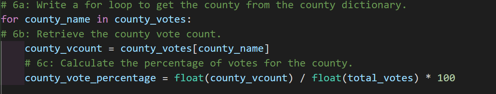
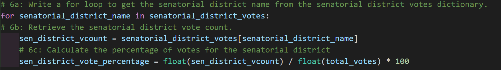

# Election Analysis

# Overview of Election Audit
The election audit analysis is being done for a US Congressional precinct in Colorado to report:

- Total number of votes cast
- Total number of votes for each candidate
- The percentage of votes for each candidate
- Winner of the election based on the popular vote

The purpose of this analysis is to see if we can automate the process using Python programming language. If this audit is done successfully, the code can be reused not just for other Congressional districts but for Senatorial districts and local elections as well.

## Election-Audit Results

- A total of 369,711 votes were cast in this Congressional election.

- Here is a breakdown of the number of votes and the percentage of total votes for each county:

 
- Denver County had the largest number of votes.

- Here is a breakdown of the number of votes and the percentage of total votes for each county:

- Diana DeGette won the election with vote count of 272,892 votes and 73.8% of total votes.

## Election-Audit Summary

This script can be utilized to perform election analysis for any election, not just for the aforementioned districts for which it was used. The examples below illustrate specific modifications which could be done in order to achieve this.

### Example 1

Instead of using a list of counties and a dictionary of county votes, we can modify the program to use a list of senatorial districts and dictionary of senatorial district votes. See below:

can be modified to

The remainder of the program can be modified to manipulate this new list and new dictionary.

### Example 2

When calculating the percentage of votes from each Senatorial district, we can modify the for loop as follows:

can be modified to

